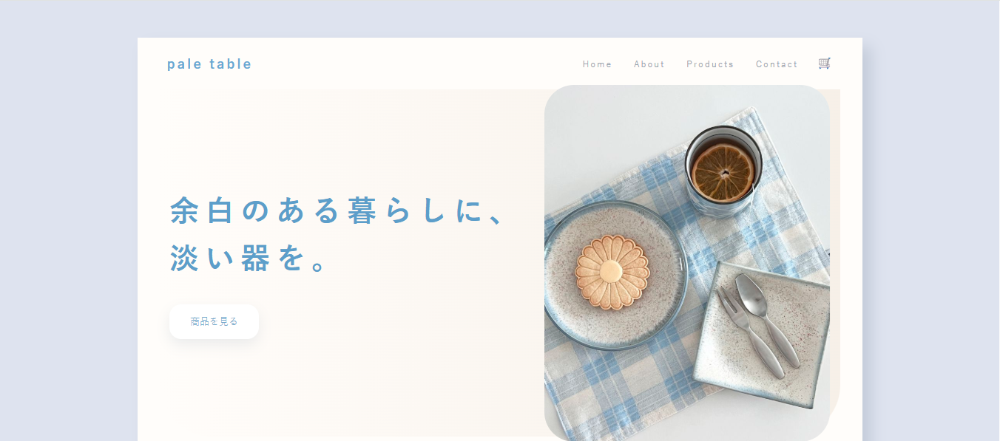
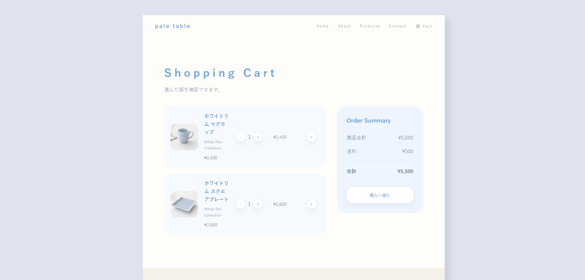

# pale-table





**「余白のある暮らしに、淡い器を。」**

架空の食器ブランド「pale table」のWebサイトです。
白・水色・淡いベージュを基調としたやさしい世界観をテーマに、商品の魅力を伝えるデザインと、JavaScriptを用いたECサイト風のカート機能を実装しました。

---

## 制作目的

* HTML・CSS・JavaScriptを用いたWebサイト制作
* LocalStorageを利用したカート機能の実装
* UIデザインとJavaScriptの学習
* GitHub Pagesでの公開

---

## ターゲット

* ナチュラルな暮らしが好きな方
* シンプルでやさしいデザインが好きな方
* 食器やインテリアに興味のある方

---

## 使用技術

* HTML5
* CSS3
* JavaScript
* LocalStorage
* GitHub Pages

---

## 主な機能

* 商品詳細の切り替え
* 商品をカートへ追加
* LocalStorageによるカート情報の保存
* 商品数量の変更
* 小計・合計金額の自動計算
* 商品の削除
* レスポンシブ対応

---

## 工夫したポイント

* 白・水色・淡いベージュを基調とした統一感のあるデザイン
* 余白を活かしたシンプルなレイアウト
* 商品一覧をクリックすると詳細情報が切り替わるUI
* JavaScriptとLocalStorageを利用したカート機能の実装
* CSSをセクションごとに整理し、保守しやすい構成を意識

---

## ディレクトリ構成

```text
pale-table/
├── css/
│   └── style.css
├── img/
├── js/
│   └── script.js
├── cart.html
└── index.html
```

---

## 公開ページ

https://pluto007-lab.github.io/pale-table/

---

## 制作

職業訓練校でのWeb制作課題として制作しました。
